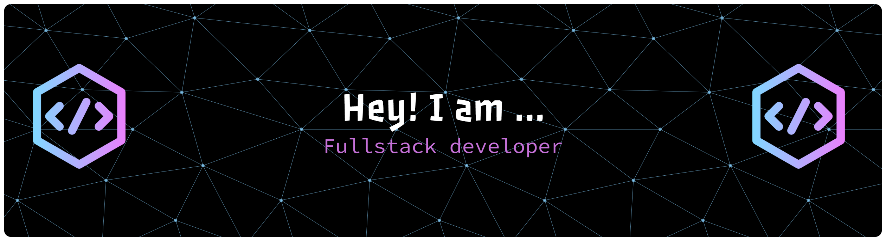

 

 
<h1 style="color:#7B3FE4; font-size:60px; font-weight:900; text-shadow: 2px 2px 8px rgba(123,63,228,0.7);">
Swetha Subramaniyam
</h1>

      

AI & Data Science student with an interest in software development and problem solving.  
Enjoys working on web applications, learning machine learning concepts, and exploring new technologies.

  
## Technical Skills  

### Programming Languages  

  
  
  
  
  
  
  

  

### Frontend Development  

  
  
  
  

  

### Backend & Database  

  
  

  

### AI & Data Science  

  
  
  
  

  

### Tools & Platforms  

  
  
  
  
  

    

---

---
 

## Projects  
### Full Stack Based Projects
| Project | Tech Used | Link |
|---|---|:---:|
| Aptitude Master – Aptitude Quiz Application | React, CSS, JavaScript |[View Project](https://github.com/Swethakit/Aptitude-Master)|
| SPA Website| React, CSS, JavaScript, |[View Project](https://github.com/Swethakit/shine_bright_spa_website)|
| Portfolio Website | React , Javascript , CSS|[View Project](https://github.com/Swethakit/portfolio)|

### AI Based Project
| Project | Tech Used | Link |
|---|---|:---:|
| HDR Image Generation Using Transformers | Python, Deep Learning, Transformers |[View Project](https://github.com/Swethakit/HDR-Image-Enhancer-)|
|AI Based SDE Knowledge Evaluator | Python, LLM, Streamlit |[View Project](https://github.com/Swethakit/SDE-knowledge-evaluator-AI)|

### **Academic**
- **B.Tech in AI & Data Science** - Kalaignar Karunanidhi Institute of Technology

### **Professional Certifications**
| Certification | Issuer | Status |
|---------------|--------|--------|
| **Cybersecurity Specialist** | Cisco |[View Certificate](https://drive.google.com/file/d/1X1RwbUGMG-h-HuOwqrW22FPAJ0qt_ylj/view?usp=drivesdk)|
| **Foundations of Data Science** | Google |[View Certificate](https://www.coursera.org/account/accomplishments/records/YAJOY6HCIIF5)|
| **Data Structures and Algorithms Using Java** | Infosys Springboard |[View Certificate](https://drive.google.com/file/d/18s2mmFkD7M0eLzsvR8YYH_a86QpIbLo_/view?usp=drivesdk)|
| **Introduction to Artificial Intelligence** | IBM |[View Certificate](https://www.coursera.org/account/accomplishments/records/SXYDK5B8WVYA)|

## Experience  

**-SocialMM** — *Generalist Intern*  
Dec 2025 – Present · Remote  
➡️ `Social Media Management` → `Content Creation` → `Branding`

**-LearnLogicify Technologies LLP** — *Full Stack Development Intern*  
Jun 2025 · On-site  
➡️ `Frontend Development` → `UI Thinking` → `Presentation Skills`

**-LITZ Tech** — *In-Plant Trainee*  
Dec 2024 · On-site  
➡️ `Python Programming` → `Industry Exposure` → `Communication`

**-Inker Robotics** — *Industrial Visit*  
Sep 2024 · On-site  
➡️ `Robotics` → `RPA` → `Automation Workflows`

## GitHub Analytics

  <!-- Activity Graph -->
  

## Activity 

  <picture>
    <source media="(prefers-color-scheme: dark)"
            srcset="https://raw.githubusercontent.com/Swethakit/Swethakit/output/snake-dark.svg">
    
  </picture>

## Let's Connect  

  
  
    

